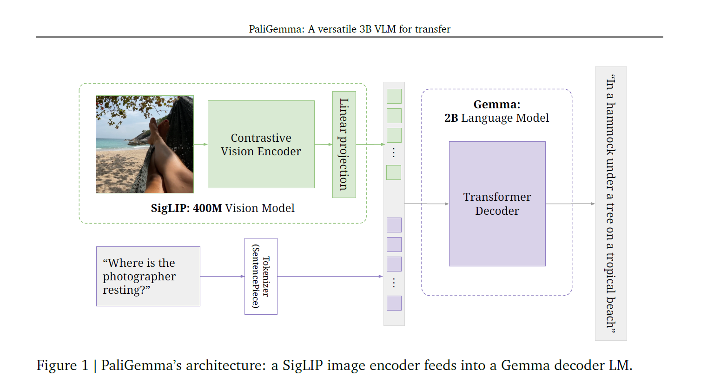

# PaliGemma-PyTorch

A compact PyTorch implementation of a PaliGemma-style multimodal inference pipeline. This project combines a SigLIP-inspired vision encoder with a Gemma decoder-only language model to answer text prompts conditioned on an input image.

The codebase is especially useful for learning how image features are projected into a language model token stream, how autoregressive decoding works with a KV cache, and how a lightweight inference loop can be built around local Hugging Face checkpoints.

## Architecture



At a high level, the pipeline works like this:

1. The image is resized, normalized, and converted into patch embeddings by the SigLIP vision tower.
2. The text prompt is prefixed with special `<image>` tokens so image slots are reserved in the sequence.
3. Vision features are projected into the Gemma hidden size with a multimodal projector.
4. Image embeddings and text embeddings are merged into one causal sequence.
5. The Gemma decoder generates the response token by token, reusing cached keys and values for faster decoding.

## Main Modules

| File | Purpose |
| --- | --- |
| `inference.py` | CLI entrypoint for inference. Selects the device, prepares model inputs, and runs autoregressive decoding with greedy decoding or top-p sampling. |
| `processing_paligemma.py` | Image preprocessing and prompt preparation. Adds the `<image>` token, appends extra location/segmentation tokens, tokenizes text, and returns `pixel_values`, `input_ids`, and `attention_mask`. |
| `modeling_siglip.py` | Vision-side implementation: patch embedding, positional embeddings, transformer encoder blocks, attention, MLP layers, and the `SiglipVisionModel`. |
| `modeling_gemma.py` | Language-side and multimodal implementation: Gemma configs, RMSNorm, rotary embeddings, decoder layers, KV cache, multimodal projector, and `PaliGemmaForConditionalGeneration`. |
| `utils.py` | Loads tokenizer, config, and `.safetensors` weights from a local Hugging Face model directory. |
| `launch_inference.sh` | Example launcher script with common runtime parameters for quick local inference. |

## Repository Flow

`PaliGemmaProcessor` in `processing_paligemma.py` prepares both modalities. The image is converted into normalized tensors, while the prompt is expanded with placeholder image tokens.

`SiglipVisionModel` in `modeling_siglip.py` turns the image into patch-level visual features. `PaliGemmaMultiModalProjector` in `modeling_gemma.py` maps those visual embeddings into the same hidden space used by the language model.

`PaliGemmaForConditionalGeneration` then merges projected image features with text embeddings and sends the combined sequence into the Gemma decoder. During generation, `KVCache` avoids recomputing previous attention states token by token.

## Requirements

Install the core dependencies before running inference:

```bash
pip install torch transformers safetensors pillow numpy fire
```

You also need a local PaliGemma checkpoint directory that contains:

- `config.json`
- tokenizer files
- one or more `.safetensors` weight files

Example model directory name used in this repo:

```bash
paligemma-3b-pt-224
```

## Launch Command

From the `PaliGemma` directory, you can launch inference directly with:

```bash
python inference.py \
  --model_path ./paligemma-3b-pt-224 \
  --prompt "What is in this image?" \
  --image_file_path ./test_images/your_image.jpg \
  --max_tokens_to_generate 100 \
  --temperature 0.8 \
  --top_p 0.9 \
  --do_sample False \
  --only_cpu False
```

Or use the helper script:

```bash
bash launch_inference.sh
```

## Notes

- This repository is focused on inference and model internals, not training or fine-tuning.
- The checkpoint path in `launch_inference.sh` should point to a locally available Hugging Face model folder.
- Replace the example image path with a real file inside `test_images/` before running inference.
